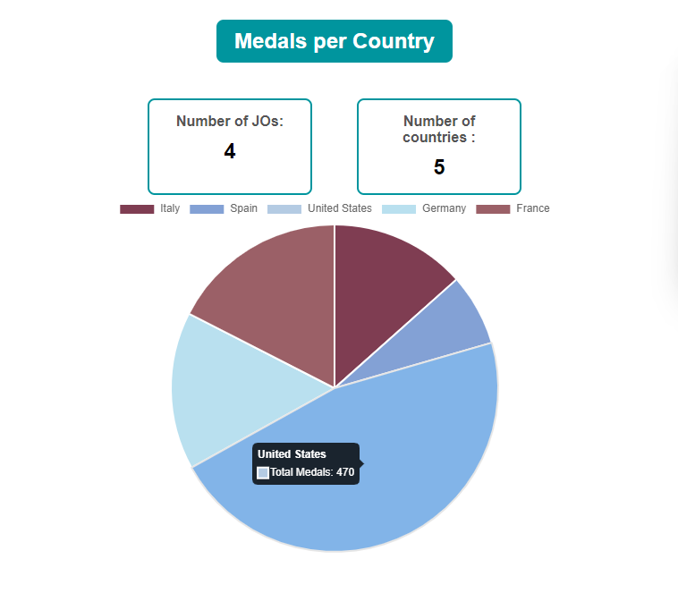
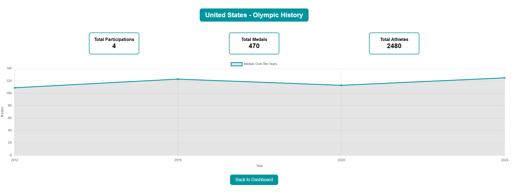

# Olympic Games Dashboard

## Description

Ce projet est une application web développée en Angular qui permet aux utilisateurs de visualiser les données des Jeux Olympiques sous forme de graphiques. L'application affiche le nombre de médailles par pays et d'autres informations pertinentes. Les données sont stockées dans un fichier JSON.

Dashboard

Details


## Prérequis

Avant de commencer, assurez-vous d'avoir installé les éléments suivants :

- [Node.js](https://nodejs.org/) (version 14.x ou supérieure recommandée)
- [Angular CLI](https://angular.io/cli) (version 18.0.3 ou supérieure)

## Installation

Clonez le projet depuis le dépôt GitHub et installez les dépendances :

```bash
git clone <votre-lien-github>
cd OlympicGamesStarter
npm install

